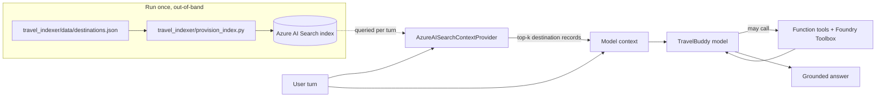

# Step 5 — Ground TravelBuddy in your own data with RAG (Azure AI Search)

> **Goal:** add **retrieval-augmented generation (RAG)** so TravelBuddy answers destination questions from a curated **Azure AI Search** index instead of the model's memory — while keeping the Step 4 function tools and Foundry Toolbox intact.

## What you'll learn

- What **RAG** is, and why grounding beats relying on the model's training data for facts you own
- The difference between a **context provider** (runs *before* the model, injects grounding) and a **tool** (the model *chooses* to call it)
- How `AzureAISearchContextProvider` retrieves the top matching records and adds them to context on every turn
- Why the search index is built **out-of-band** (once, by a script) so your deployment shape doesn't change — still `resources: []`, no `azd provision`
- How to keep the Step 4 tools + toolbox working while layering retrieval on top

## What's already in the repo

- `travel_assistant/main.py`, `travel_assistant/tools.py`, `agent.yaml`, `agent.manifest.yaml`, `requirements.txt` — carried over from Step 4 (TravelBuddy with the three function tools **and** the Foundry Toolbox). Nothing was deleted when you advanced.
- `travel_assistant/data/itinerary.csv` — the Step 4 sample itinerary for Code Interpreter.
- `travel_indexer/` — a **new sibling folder** (delivered when you advanced) that holds everything the index needs, *outside* the agent snapshot:
  - `travel_indexer/data/destinations.json` — a small seed of curated destination records (city, country, summary, highlights). This is the corpus you'll index.
  - `travel_indexer/provision_index.py` — a complete, one-shot script that creates the Search index and uploads the destinations. You run it once, out-of-band. It needs no separate dependencies: `azure-search-documents`, `azure-identity`, and `python-dotenv` are already in the environment you built from `travel_assistant/requirements.txt`.
- `travel_toolbox/toolbox.yaml` — the toolbox definition from Step 4, still a sibling of `travel_assistant/`. Unchanged this step.

**Why the indexer lives in `travel_indexer/`, not in `travel_assistant/`.** `azd ai agent init` snapshots **only** `travel_assistant/` when it packages the deployed agent. The index is built once, offline — the provisioning script and its source JSON are *tooling*, not part of the running agent — so they live in a sibling folder that is never bundled into the agent container. This is the same reason `travel_toolbox/` sits outside the snapshot. At runtime the agent reaches the finished index over the network; it never needs `provision_index.py` or `destinations.json` on disk.

In this step you make **delta-only** edits: provision the index once, set **two** new environment variables (`AZURE_AI_SEARCH_ENDPOINT`, `AZURE_AI_SEARCH_INDEX_NAME`), add an `AzureAISearchContextProvider` to `main.py`'s `context_providers`, append two grounding sentences to the instructions, and update `agent.yaml` + the manifest metadata. You keep your function tools and toolbox — you only add what RAG needs.

## Prerequisites

RAG needs an **Azure AI Search** resource. This is a **participant-provided** Azure resource — it is *not* declared in the manifest and *not* created by `azd provision`. Before you start:

- An Azure AI Search service (Basic tier or higher). Copy its endpoint (e.g. `https://<name>.search.windows.net`).
- Role assignments on that service so `DefaultAzureCredential` works without keys. `provision_index.py` both **creates the index definition** and **uploads documents**, which are two different permissions:
  - **`Search Service Contributor`** — create/delete the index definition.
  - **`Search Index Data Contributor`** — upload the destination documents (and query them locally).

  These two roles are for **you** (your `az login` user) — they let you provision the index and run TravelBuddy locally. The **deployed** agent queries Search under a *different* identity that only exists after you deploy, so you grant it read access (`Search Index Data Reader`, least privilege) in [step 6](#run-and-deploy-travelbuddy), not here.

<!-- terminal -->
```bash
SCOPE="/subscriptions/<sub-id>/resourceGroups/<rg>/providers/Microsoft.Search/searchServices/<search-name>"
USER_ID="$(az ad signed-in-user show --query id -o tsv)"
az role assignment create --assignee "$USER_ID" --role "Search Service Contributor" --scope "$SCOPE"
az role assignment create --assignee "$USER_ID" --role "Search Index Data Contributor" --scope "$SCOPE"
```

<!-- terminal -->
```powershell
# PowerShell
$SCOPE = "/subscriptions/<sub-id>/resourceGroups/<rg>/providers/Microsoft.Search/searchServices/<search-name>"
$USER_ID = az ad signed-in-user show --query id -o tsv
az role assignment create --assignee $USER_ID --role "Search Service Contributor" --scope $SCOPE
az role assignment create --assignee $USER_ID --role "Search Index Data Contributor" --scope $SCOPE
```

## Concept (5-min read)

Large language models are confident but stale: they only know what was in their training data, and they'll happily invent details about a destination they've never seen your notes on. **Retrieval-augmented generation (RAG)** fixes this by splitting the problem into two halves:

1. **Index once (offline).** You take the data you own — here, a JSON file of destination records — and load it into a search index. Each record becomes a searchable document. This is `provision_index.py`, and it runs once, out-of-band, exactly like the toolbox in Step 4.
2. **Retrieve every turn (online).** On each user message, a **context provider** runs a search against that index, pulls back the top matching records, and injects them into the model's context *before* the model responds. Each record arrives labelled with its source id (`[Source: lisbon] ...`), giving the model your text to answer from and a handle to point back at.

> **What's a "turn"?** One user message plus the agent's reply to it — a single `agent.run()`, one call to the agent's `/responses` endpoint. A **session** is the sequence of turns that make up one conversation. Note that a turn can contain *several* model round-trips when the model calls tools; the context provider still runs **once** per turn, before the first of them, and the records it injects stay in context for the rest of the turn.
>
> Keep *when* the provider runs separate from *what it searches with*. It fires once per **turn**, but in semantic mode it joins **every non-empty user/assistant message the host hands it** (`context.input_messages`) into a single query string — and in the hosted runtime you're using here, that's the whole conversation replayed so far. So the records it injects reflect the session, not just the question you asked. The injected block itself is *not* persisted into the conversation: every turn gets exactly one freshly retrieved set. That difference is the single most surprising thing about this step; see the note under [Try it](#try-it).

The key mental model is **context provider vs. tool**:

- A **tool** (Step 2 functions, Step 4 toolbox) is something the model *decides* to call, mid-turn, when it reasons that it needs to. Retrieval is not guaranteed.
- A **context provider** runs *automatically, before* the model sees the turn. `AzureAISearchContextProvider` always runs the search and injects what it finds, so the model can't "forget" to look at your data — though it's still the model's job to *use* what it was handed.

That reliability has one cost worth knowing up front: because a provider shapes the **request** rather than appearing in the model's **output**, retrieval leaves no trace in the Playground's **View run info** — a tool call shows up there as a `function_call` item, an injected context block does not. To see what was retrieved, log it yourself (see the note under [Try it](#try-it)).

That's why RAG is a provider, not a tool: grounding should be reliable, not optional. TravelBuddy keeps all four Step 4 tools (weather, local time, currency, toolbox) — those still fire when the model needs live actions — and *adds* retrieval as a provider so factual destination answers come from your index.



### Three ways to wire retrieval

This step builds the first row. The other two solve the limits you'll meet in [Try it](#try-it), and both are covered later in this doc:

| | Semantic provider *(this step)* | Agentic provider + Foundry IQ | Retrieval as an MCP tool |
|---|---|---|---|
| **Who triggers retrieval** | framework, every turn | framework, every turn | the **model**, when it judges it needs to |
| **Query it searches with** | every non-empty user/assistant message replayed, joined into one string | the last *N* messages; at `low`/`medium` reasoning effort an LLM splits them into sub-queries (`minimal` skips planning and queries directly) | whatever the model passes as an argument |
| **Several topics at once** | competes for the same `top_k` slots | sub-queries run in parallel, then reranked and merged | one call per topic, when the model makes them |
| **Extra infrastructure** | none — just the index | knowledge base (+ a query-planning model) | an MCP server you host |
| **Retrieval automatic?** | yes | yes | **no** — the model can skip the call |
| **Good for** | a focused corpus and predictable cost | many sources, permission-aware access, complex questions | model-driven, per-entity lookups |

The trade is straightforward: providers always retrieve but own the query, so a poor query is invisible to the model; a tool hands query-writing to the model, which helps multi-topic questions but makes retrieval optional. Foundry IQ buys back the query quality *without* making retrieval optional — at the cost of a managed knowledge base. Both alternatives are **optional** side-paths, written up at the end of this step, and both are 🧪 experimental — not tested against this workshop's deployment: [Foundry IQ & agentic retrieval](#where-this-goes-next-foundry-iq--agentic-retrieval) and [Retrieval as an MCP tool](#retrieval-as-an-mcp-tool).

### Why there's no embedding model here

If you've seen RAG before, you might expect an **embedding model** turning each record into a vector for similarity search. This workshop deliberately does **not** use one, and it's worth understanding why:

- **The corpus is tiny and curated.** Ten short, well-written destination records match reliably on **keyword (full-text) search** alone. `provision_index.py` defines a single searchable `content` field with the `standard.lucene` analyzer, so Azure AI Search ranks results with **BM25** — classic lexical relevance. No vectors, no embedding deployment, no extra cost or infrastructure.
- **`mode="semantic"` here is still keyword search.** The `AzureAISearchContextProvider` accepts `mode="semantic"`, but that name refers to its search *code path*, not to the Azure AI Search **semantic ranker**. Because our index has **no vector field** and we pass **no `semantic_configuration_name`**, the provider auto-detects "no vector fields" and falls back to a plain BM25 query. You get simple, predictable, zero-dependency retrieval — ideal for a first RAG lesson.

**When you'd add an embedding model (and how).** For large, unstructured, or paraphrase-heavy corpora, lexical search misses matches that don't share exact words ("aurora" vs. "northern lights"). Then you add **vector search**:

1. Deploy an embedding model (e.g. `text-embedding-3-small`) in Azure OpenAI / Foundry Models.
2. Add a vector field to the index and either wire up **integrated vectorization** (the index calls the embedding model for you) or pass an `embedding_function` to the provider. The provider **auto-discovers** the vector field and switches to hybrid (keyword + vector) retrieval.
3. Optionally enable the **semantic ranker** by adding a semantic configuration to the index and passing `semantic_configuration_name` — an L2 reranker that reorders the top results for relevance.

None of that is required for TravelBuddy's ten records, so we keep Step 5 focused on the RAG *shape* (index once, retrieve every turn) rather than embedding plumbing. See the vector-search links under **Learn more**.

**Learn more**

- [Retrieval-augmented generation in Azure AI Search](https://learn.microsoft.com/azure/search/retrieval-augmented-generation-overview)
- [Azure AI Search — full-text search & indexes](https://learn.microsoft.com/azure/search/search-what-is-azure-search)
- [Vector search in Azure AI Search](https://learn.microsoft.com/azure/search/vector-search-overview)
- [Integrated vectorization (index calls the embedding model for you)](https://learn.microsoft.com/azure/search/vector-search-integrated-vectorization)
- [Semantic ranking in Azure AI Search](https://learn.microsoft.com/azure/search/semantic-search-overview)
- [Role-based access for Azure AI Search](https://learn.microsoft.com/azure/search/search-security-rbac)
- [Hosted agents in Microsoft Foundry](https://learn.microsoft.com/azure/ai-foundry/agents/)
- [What are hosted agents? — Key concepts (agent identity vs. project managed identity)](https://learn.microsoft.com/azure/foundry/agents/concepts/hosted-agents#key-concepts)
- [Agent identity concepts in Microsoft Foundry](https://learn.microsoft.com/azure/foundry/agents/concepts/agent-identity) — per-agent Entra identities and the runtime OAuth token exchange
- [Hosted agent permissions reference](https://learn.microsoft.com/azure/foundry/agents/concepts/hosted-agent-permissions) — project-MI platform permissions, and data-plane roles for downstream resources (Storage, **Azure AI Search**, Key Vault) on the calling/agent identity
- [Manage hosted agents — retrieve the agent identity for role assignments](https://learn.microsoft.com/azure/foundry/agents/how-to/manage-hosted-agent#retrieve-the-agent-identity-for-role-assignments) — `instance_identity.principal_id` retrieval
- [Connect a Foundry IQ knowledge base to Foundry Agent Service](https://learn.microsoft.com/azure/foundry/agents/how-to/foundry-iq-connect#prerequisites) — the managed RAG path assigns Search roles to the **project managed identity** (unlike the in-code provider, which uses the agent identity)
- [Credential chains in the Azure Identity library for Python (`DefaultAzureCredential`)](https://learn.microsoft.com/azure/developer/python/sdk/authentication/credential-chains) — why in-container code resolves the managed identity
- [Authenticate Azure-hosted Python apps with a system-assigned managed identity](https://learn.microsoft.com/azure/developer/python/sdk/authentication/system-assigned-managed-identity)
- [How managed identities work with Azure VMs (IMDS token endpoint)](https://learn.microsoft.com/entra/identity/managed-identities-azure-resources/how-managed-identities-work-vm)
- [Upstream `11-azure-search-rag` hosted-agent sample](https://github.com/microsoft-foundry/foundry-samples/tree/main/samples/python/hosted-agents/agent-framework/responses/11-azure-search-rag) — the sample this step is based on.

## Steps

### 1. Review the destination corpus

Open `travel_indexer/data/destinations.json`. Each record is one destination:

```json
// travel_indexer/data/destinations.json (excerpt)
[
  {
    "id": "reykjavik",
    "city": "Reykjavik",
    "country": "Iceland",
    "summary": "Compact, walkable capital that is the launch point for the Golden Circle and winter aurora tours.",
    "highlights": ["Northern lights (Sep-Apr)", "Blue Lagoon geothermal spa", "Golden Circle day trips"]
  }
]
```

This is the data you own. Add or edit records freely — anything you index here becomes answerable, and re-running the provisioning script picks up your edits.

The Lisbon record also carries a deliberately synthetic fact — `TravelBuddy's internal concierge desk code for Lisbon is LIS-CANARY-4718`. It's a **canary token**: an invented string the model has no ordinary reason to know, so if the agent returns it, that's a strong signal the answer came from retrieval. You'll use it under [Try it](#try-it). (For proof rather than a strong signal, invent your own token, index it, and never publish it — this one lives in a public template repository, so it can't be guaranteed absent from a future model's training data.)

### 2. Provision the index (out-of-band)

Open `travel_indexer/provision_index.py` and read it — you're expected to understand it, not just run it. It defines the index schema in `build_index()`, flattens each destination into a searchable document, and uploads them. The parts that matter:

- **`content`** is the one **searchable** field. `load_destinations()` flattens each record's city, country, summary, and highlights into a single `content` string, so full-text search matches on all of it.
- **`sourceName` / `sourceLink`** are stored as retrievable metadata for your own use. Note the context provider doesn't surface them: it injects the `content` field prefixed with `[Source: <id>]`, so the record **id** is what the model sees as the citation handle.
- **`RECREATE = True`** deletes and rebuilds the index each run — convenient for the workshop. The script uses `merge_or_upload_documents`, so re-running is idempotent.

Set the two new variables in your `.env` file, then run the script once. The script calls `load_dotenv()`, so it reads `.env` from the repo root automatically — no `export` needed. It reuses the agent's environment — `azure-search-documents`, `azure-identity`, and `python-dotenv` are already installed from `travel_assistant/requirements.txt`, so no extra install is needed (Azure AI Search is out-of-band — this does not touch azd).

Open `.env` at the repo root and fill in the two Step 5 variables:

```dotenv
# Step 5: Azure AI Search endpoint and index for RAG.
AZURE_AI_SEARCH_ENDPOINT=https://<your-search>.search.windows.net
AZURE_AI_SEARCH_INDEX_NAME=<your-prefix>-destinations
```

Two things to get right:

- The endpoint **must** start with `https://` (a plain `http://` or scheme-less value fails with `Bearer token authentication is not permitted for non-TLS protected (non-https) URLs`).
- `.env` does **not** expand `${WORKSHOP_RESOURCE_PREFIX}`, so write the literal index name — use your actual prefix, e.g. `foundry-workshop-destinations`.

Then run the script — with `python`:

<!-- terminal -->
```bash
python travel_indexer/provision_index.py
```

…or with `uv` (uses your `.venv` without activating it):

<!-- terminal -->
```bash
uv run python travel_indexer/provision_index.py
```

You should see `Done. TravelBuddy's destination index is ready.`

> The script loads `.env` with `override=True`, so the value in `.env` wins even if you previously ran `export AZURE_AI_SEARCH_ENDPOINT=...` in this shell — just correct `.env` and rerun the script.

### 3. Add retrieval to `main.py`

Keep everything from Step 4 — the imports, `tools.py` functions, the `FoundryToolbox`, and the `tools` list. Make three changes: add one import, build the search context provider and pass it to the `Agent` via `context_providers`, and append two sentences to the instructions so the model prefers the index for destination facts (the rest of the Step 4 prompt stays verbatim):

```python
# travel_assistant/main.py (delta from Step 4)
from agent_framework.azure import AzureAISearchContextProvider  # NEW

# ... existing imports, credential, client, tools, and toolbox from Step 4 stay ...

# RAG: search the destinations index before each turn and inject the top matches
# into context on every turn.
search_endpoint = os.environ["AZURE_AI_SEARCH_ENDPOINT"]       # NEW
search_index_name = os.environ["AZURE_AI_SEARCH_INDEX_NAME"]   # NEW
context_providers = [                                          # NEW
    AzureAISearchContextProvider(
        source_id="travelbuddy_destinations",
        endpoint=search_endpoint,
        index_name=search_index_name,
        credential=credential,
        mode="semantic",
        top_k=3,
    )
]

agent = Agent(
    client=client,
    name="travel-buddy",
    instructions=(
        # ... all of the Step 4 instruction sentences stay verbatim ...
        "uploaded itinerary.csv (budget totals, currency conversion, charts). "
        "Use the grounded destination context when relevant; if the destinations "  # NEW
        "index does not contain enough detail, say what is missing."                 # NEW
    ),
    tools=tools,                        # unchanged: 3 functions + toolbox
    context_providers=context_providers,  # NEW — RAG grounding on every turn
    default_options={"store": False},
)
```

`context_providers` is the only structural change; the two extra instruction sentences are a prompt tweak. `AzureAISearchContextProvider` runs the search, formats the top 3 records, and prepends them to context every turn — no tool call required. RAG is a required capability here: reading `AZURE_AI_SEARCH_ENDPOINT` and `AZURE_AI_SEARCH_INDEX_NAME` with `os.environ["..."]` (like the project endpoint and model in earlier steps) fails fast with a clear `KeyError` if either is missing, so you never run against a half-configured index.

### 4. Update `agent.yaml`

Add **only** the two new variables. Leave `TOOLBOX_ENDPOINT` and everything from earlier steps in place:

```yaml
# travel_assistant/agent.yaml (delta — add to environment_variables)
  - name: AZURE_AI_SEARCH_ENDPOINT
    value: ${AZURE_AI_SEARCH_ENDPOINT}
  - name: AZURE_AI_SEARCH_INDEX_NAME
    value: ${AZURE_AI_SEARCH_INDEX_NAME}
```

### 5. Update the manifest

The manifest changes add no Azure resource — `resources` stays `[]`, so there is nothing for azd to provision. What you're editing is the agent's descriptive metadata plus two runtime environment variables.

Update the `description` to mention RAG:

```yaml
# travel_assistant/agent.manifest.yaml
description: >
  ... existing Step 4 description ..., and RAG grounding over a curated
  destinations index in Azure AI Search.
```

Add the `RAG` tag (keep the rest) and declare the retrieval surface under `tool_declarations` (keep the Step 4 entries):

```yaml
metadata:
  tags:
    - Agent Framework
    - AI Agent Hosting
    - Azure AI AgentServer
    - Responses Protocol
    - Travel Assistant
    - Function Tools
    - MCP Tools
    - Toolbox Tools
    - RAG                    # <-- added
  tool_declarations:
    # ... keep the get_weather / get_local_time / convert_currency / travel-toolbox entries ...
    - name: travelbuddy_destinations     # <-- added: the retrieval surface
      description: >
        Azure AI Search retrieval over the curated destinations index; injects the
        top-k matching destination records into context before each turn.
      type: azure_ai_search
      endpoint: ${AZURE_AI_SEARCH_ENDPOINT}
```

Then mirror the two new variables into the **existing** `template.environment_variables` list (keep the earlier entries):

```yaml
template:
  # ... name, kind, protocols unchanged ...
  environment_variables:
    # ... AZURE_AI_PROJECT_ENDPOINT, AZURE_AI_MODEL_DEPLOYMENT_NAME, WORKSHOP_RESOURCE_PREFIX, TOOLBOX_ENDPOINT ...
    - name: AZURE_AI_SEARCH_ENDPOINT     # <-- added
      value: ${AZURE_AI_SEARCH_ENDPOINT}
    - name: AZURE_AI_SEARCH_INDEX_NAME   # <-- added
      value: ${AZURE_AI_SEARCH_INDEX_NAME}

resources: []                            # <-- unchanged: the index is created out-of-band
```

## Run and deploy TravelBuddy

**Do you need to re-init? Yes.** In earlier steps, `azd ai agent init` **copied** your `travel_assistant/` code into the generated `${WORKSHOP_RESOURCE_PREFIX}-travel-buddy/` project folder — that copy is the snapshot azd actually builds and deploys. Your Step 5 edits (the `main.py` context-provider addition and the manifest/`agent.yaml` changes) live in `travel_assistant/`, so the copied snapshot is now **stale**. Re-run `azd ai agent init` to refresh it before you run or deploy.

**Do you need `azd provision`? No.** You added no new Azure resource to the manifest (`resources:` is still `[]`) — the Azure AI Search index was created out-of-band by `provision_index.py`. The infrastructure from earlier steps is unchanged.

1. **Re-init from the repository root.** Load your `.env` into the shell first — the repo `.env` isn't auto-loaded, and the shell needs `WORKSHOP_RESOURCE_PREFIX` to expand `--agent-name` (and to `cd` into the folder later):

   <!-- terminal -->
   ```bash
   # bash / zsh
   set -a; source .env; set +a
   azd ai agent init -m travel_assistant/agent.manifest.yaml \
     --agent-name "${WORKSHOP_RESOURCE_PREFIX}-travel-buddy"
   ```

   <!-- terminal -->
   ```powershell
   # PowerShell
   Get-Content .env | Where-Object { $_ -match '^\s*[^#].*=' } | ForEach-Object {
     $name, $value = $_ -split '=', 2
     Set-Item "Env:$($name.Trim())" $value.Trim()
   }
   azd ai agent init -m travel_assistant/agent.manifest.yaml `
     --agent-name "$($env:WORKSHOP_RESOURCE_PREFIX)-travel-buddy"
   ```

   This refreshes the `${WORKSHOP_RESOURCE_PREFIX}-travel-buddy/` folder with your updated `main.py` and manifest metadata (including the new `AZURE_AI_SEARCH_ENDPOINT` and `AZURE_AI_SEARCH_INDEX_NAME` variables).

2. **`cd` into the project folder and add the new values to the azd env.** azd keeps its **own** environment store (`.azure/<env-name>/.env`), separate from the repo `.env`. The Foundry values are already in the azd env from earlier steps, so you only need to set the **two new** Search variables. Keep `.env` loaded in the shell so you can pass the values through:

   <!-- terminal -->
   ```bash
   # bash / zsh — after: set -a; source .env; set +a
   cd "${WORKSHOP_RESOURCE_PREFIX}-travel-buddy"
   azd env set AZURE_AI_SEARCH_ENDPOINT "$AZURE_AI_SEARCH_ENDPOINT"
   azd env set AZURE_AI_SEARCH_INDEX_NAME "$AZURE_AI_SEARCH_INDEX_NAME"
   ```

   <!-- terminal -->
   ```powershell
   # PowerShell — after loading .env into the shell
   cd "$($env:WORKSHOP_RESOURCE_PREFIX)-travel-buddy"
   azd env set AZURE_AI_SEARCH_ENDPOINT "$env:AZURE_AI_SEARCH_ENDPOINT"
   azd env set AZURE_AI_SEARCH_INDEX_NAME "$env:AZURE_AI_SEARCH_INDEX_NAME"
   ```

3. **Run TravelBuddy locally** in the hosted Responses runtime:

   <!-- terminal -->
   ```bash
   azd ai agent run
   ```

   `azd` reads `agent.yaml`, substitutes values from your azd environment, and starts the server on `http://localhost:8088` — now with your Step 4 function tools and toolbox **and** the Azure AI Search context provider grounding every turn. Leave this terminal running.

4. **Invoke the local agent from a second terminal.** Open a **new** terminal (in the same project folder) and ask a question that hits the destinations index:

   <!-- terminal -->
   ```bash
   azd ai agent invoke --local "What does our index say about Reykjavik in winter?"
   ```

   Expected: TravelBuddy answers from your indexed destination record rather than relying on the model's general knowledge.

   Prefer a UI? With the local agent still running, open the **Agent Inspector** from the Foundry Toolkit (Command Palette → **Foundry Toolkit: Open Agent Inspector**). It connects to `http://localhost:8088` and shows the retrieved context injected before each response.

5. **Deploy to Foundry**:

   <!-- terminal -->
   ```bash
   azd deploy
   ```

   This builds the container image from the **refreshed** project-folder snapshot — now including the RAG context provider and Search env vars — pushes it to your Azure Container Registry, and rolls out a new hosted agent version. No `azd provision` is needed because the infrastructure is unchanged.

6. **Grant the deployed agent's instance identity read access to the index.** Locally the agent queried Search as *you*. Deployed, its `AzureAISearchContextProvider` calls Search with `DefaultAzureCredential`, which resolves the container's runtime identity — the agent's **instance identity** (a per-agent Microsoft Entra service principal). That principal has no Search role by default, so grant it the least-privilege **`Search Index Data Reader`** — and nothing broader.

   First retrieve the instance identity's principal ID from the **agent** (not a version), then assign the role. `$SCOPE` is the **same Search-service scope from [Prerequisites](#prerequisites)**.

   <!-- terminal -->
   ```bash
   # AGENT_NAME is your deployed agent; AZURE_AI_PROJECT_ENDPOINT is already in your .env from earlier steps.
   AGENT_NAME="${WORKSHOP_RESOURCE_PREFIX}-travel-buddy"

   # 1. Resolve the agent's instance identity principal ID.
   AGENT_IDENTITY="$(az rest --method GET \
     --url "${AZURE_AI_PROJECT_ENDPOINT}/agents/${AGENT_NAME}?api-version=v1" \
     --resource "https://ai.azure.com" \
     --query "instance_identity.principal_id" -o tsv)"

   # 2. Grant it read-only access to the Search service.
   SCOPE="/subscriptions/<sub-id>/resourceGroups/<rg>/providers/Microsoft.Search/searchServices/<search-name>"   # same as Prerequisites
   az role assignment create \
     --assignee-object-id "$AGENT_IDENTITY" \
     --assignee-principal-type ServicePrincipal \
     --role "Search Index Data Reader" \
     --scope "$SCOPE"
   ```

   <!-- terminal -->
   ```powershell
   # PowerShell — AZURE_AI_PROJECT_ENDPOINT is already in your .env from earlier steps.
   $AGENT_NAME = "${env:WORKSHOP_RESOURCE_PREFIX}-travel-buddy"   # your deployed agent's name

   # 1. Resolve the agent's instance identity principal ID.
   $AGENT_IDENTITY = az rest --method GET `
     --url "${env:AZURE_AI_PROJECT_ENDPOINT}/agents/${AGENT_NAME}?api-version=v1" `
     --resource "https://ai.azure.com" `
     --query "instance_identity.principal_id" -o tsv

   # 2. Grant it read-only access to the Search service.
   $SCOPE = "/subscriptions/<sub-id>/resourceGroups/<rg>/providers/Microsoft.Search/searchServices/<search-name>"   # same as Prerequisites
   az role assignment create `
     --assignee-object-id $AGENT_IDENTITY `
     --assignee-principal-type ServicePrincipal `
     --role "Search Index Data Reader" `
     --scope $SCOPE
   ```

   RBAC changes take a minute or two to propagate; retry the Playground afterward.

   > **Do you re-grant this on every redeploy? No.** The instance identity belongs to the **agent**, not to an agent *version*. `azd deploy` just publishes a new version of the same agent, so the identity — and this role assignment — **carry over** untouched (agent identities persist for the life of the agent). You only need to repeat the grant if you **delete and recreate** the agent (a new agent gets a new instance identity) or **publish** it to an agent application, which creates a *distinct* identity that prior role assignments don't transfer to — reassign to its new principal ID then. See [Retrieve the agent identity for role assignments](https://learn.microsoft.com/azure/foundry/agents/how-to/manage-hosted-agent#retrieve-the-agent-identity-for-role-assignments) and [Agent identity concepts](https://learn.microsoft.com/azure/foundry/agents/concepts/agent-identity).
   >
   > **Why the agent identity and not the project managed identity?** The project MI handles *platform* operations (model-inference proxy, ACR image pull, Log Analytics telemetry); your in-container code reaching a downstream resource like Azure AI Search authenticates as the **agent instance identity** — Microsoft's permissions reference notes data-plane roles for Storage/Search/Key Vault go to *"the calling identity or the agent identity"* ([hosted agent permissions](https://learn.microsoft.com/azure/foundry/agents/concepts/hosted-agent-permissions)). Granting per-agent also gives you real least-privilege isolation. (The exception is **Foundry Agent Service's managed Foundry IQ integration**, where Foundry — not your code — performs the retrieval and uses the project MI; calling Search from your own code always uses the agent identity, whatever the provider mode. See *Where this goes next*.)

7. **Invoke the deployed agent**:

   <!-- terminal -->
   ```bash
   azd ai agent invoke "What does our index say about Reykjavik in winter?"
   ```

   Prefer a UI? Open the **Hosted Agent Playground** from the Foundry Toolkit (**Developer Tools** → **Build** → **Hosted Agent Playground**), pick your deployed agent and version, and watch the grounded answers in the session details.

## Try it

Each prompt below names **one** destination on purpose — see the note after the list.

- `What does our destinations index say about Reykjavik in winter?` — a single-destination lookup; Reykjavik lands at the top of the retrieval window, so the answer comes from the indexed record.
- `What is TravelBuddy's internal concierge desk code for Lisbon?` — should return `LIS-CANARY-4718`. This is the **signal that retrieval ran**: the code is a canary token that exists in your index and nowhere the model would ordinarily have seen. (To watch the agent lose it, comment out `context_providers=context_providers` in `main.py`, restart, and ask again in a **New Session** — the same session would replay the earlier answer containing the code, letting the model repeat it without retrieving anything. Unsetting `AZURE_AI_SEARCH_ENDPOINT` won't work either: the running process already read it, and a restart without it fails fast with `KeyError`.)
- `Plan a spring day in Lisbon from our index, then find flights from Seattle (SEA) to Lisbon (LIS).` — grounds on the Lisbon record **and** calls the toolbox flights MCP.
- `Convert the average hotel price of €180/night to USD.` — proves the Step 2 currency tool still works alongside RAG.

> Retrieval injects only the **top 3** matching records each turn (`top_k=3` in the context provider). Keep a grounding prompt focused on **one** destination: a query that names several cities (for example "compare Lisbon *and* Reykjavik") competes for those three slots, so one city can fall outside the window and the agent will honestly say it has no context for it. Raise `top_k` if you want multi-destination comparisons to ground reliably.

> **Note — grounding several destinations, or a new one mid-conversation (four options).** The `top_k=3` window is shared, and in semantic mode the provider builds its search query from **every user + assistant message replayed so far**, not just the latest question:
>
> ```python
> # AzureAISearchContextProvider.before_run (agent-framework)
> filtered_messages = [m for m in context.input_messages
>                      if m.text.strip() and m.role in ["user", "assistant"]]
> if self.mode == "semantic":
>     query = "\n".join(msg.text for msg in filtered_messages)   # the whole history
> ```
>
> Turn on the optional debug provider below and the whole mechanism is visible in one session. Ask `What can I do in Tokyo from the index?`, then follow up with `And about Paris?`:
>
> ```text
> [RAG] query='What can I do in Tokyo from the index?'
> [RAG] hits=['[Source: marrakech] ...', '[Source: tokyo] ...', '[Source: vancouver] ...']
>
> [RAG] query='What can I do in Tokyo from the index?\nFrom the Tokyo index, you can
>              focus on:\n- Quiet gardens\n- Neon crossings\n- Tiny restaurants\n ...
>              \nAnd about Paris?'
> [RAG] hits=['[Source: tokyo] ...', '[Source: marrakech] ...', '[Source: vancouver] ...']
> ```
>
> Seen side by side in the Playground, the chat on the left looks unremarkable while the logs on the right show what retrieval actually did:
>
> 
>
> Three things to read out of that trace. **The first query is exactly your question** — and even so, only one of the three records is about Tokyo: `marrakech` came back ranked above it. (The trace records the order, not the scores; to see *why*, re-run the query in **Search explorer** and compare `@search.score`. Azure AI Search defaults to `searchMode=any`, so ordinary shared words are enough to pull a record into the window.) **The second query is the first question plus the agent's entire answer plus the new one** — that `role in ["user", "assistant"]` filter feeds grounded answers back in, and since a grounded answer quotes the record it used, Tokyo is now rank 1 while the genuinely new topic contributes three words. **The window never widens**: `top_k` slots, an ever-growing query.
>
> What this trace demonstrates is **query accumulation and a shift in ranking toward what you already discussed** — not, on its own, that an indexed city gets pushed out. (Paris here is genuinely absent: there is no Paris record in `destinations.json`, so this trace says nothing about how a *present* record would have fared.) What you can see is the query growing: by turn 2 it carries every term from Tokyo's answer, and a third turn about a new city adds only a sentence against all of that. Whether those extra terms actually displace a city that *is* indexed depends on the corpus — a rare exact name can still score well — so test it on yours rather than assuming.
>
> One thing the request payload makes easy to misread: the retrieved block always appears at the **top**, ahead of the whole conversation, because the framework assembles `context messages + input messages` in that order. It looks like the search ran before your question was taken into account — it didn't. Your question *is* in the query; it is simply one contribution among everything said before it.
>
> Before blaming the window, rule out the index: a missing document and a crowded-out one can produce indistinguishable answers, so confirm the city is actually retrievable — see the [Troubleshooting entry](#the-agent-says-it-has-no-entry-for-a-city-that-is-in-destinationsjson).
>
> That's a property of hand-built single-query RAG, not a bug — and there is no config knob for it (`agentic_message_history_count` trims the history in *agentic* mode only; in semantic mode it is unused). Four ways to handle it, cheapest first:
>
> 1. **Custom provider + code.** Subclass `AzureAISearchContextProvider` and, in `before_run`, narrow the query to the **current user turn** (or the last couple of user messages) before it searches. The query stops accumulating, so each turn grounds on the destination actually being asked about. Smallest change, no new Azure resources — this is the targeted fix. (Raising `top_k`, from the note above, is the blunt one-line version.)
> 2. **Multi-agent routing needs explicit narrowing.** Splitting into the [Step 7 — Multi-agent](.workshop/docs/steps/07-multi-agent.md) group chat does **not** reliably shrink the query on its own. In Step 7's default manager-led group chat the manager only picks who speaks next — it doesn't hand that specialist a reformulated, single-topic sub-request. User messages are broadcast to every specialist and each specialist's reply is broadcast to the others, so a grounded specialist can still search over earlier destinations and other specialists' output. To make routing actually narrow retrieval, pair it with **option 1** (a per-turn provider on the specialist) or **option 4** (retrieval as a per-destination tool the specialist calls itself).
> 3. **Agentic mode / Foundry IQ.** Switch the *same* provider to `mode="agentic"` against a Foundry IQ knowledge base: at `low`/`medium` reasoning effort an LLM decomposes a multi-destination question into focused sub-queries, retrieves each in parallel, reranks, and merges — purpose-built for exactly this. See [Where this goes next: Foundry IQ & agentic retrieval](#where-this-goes-next-foundry-iq--agentic-retrieval) below (🧪 experimental).
> 4. **Retrieval as a tool (MCP in front of Search or a vector database).** Instead of always injecting context, expose search as an **MCP tool** the model calls on demand — it formulates its own per-destination query and can call it once per city. Most flexible; you own the extra server, and the model has to choose to call it. See [Retrieval as an MCP tool](#retrieval-as-an-mcp-tool) below (🧪 experimental).

<details>
<summary><strong>Optional: see what was actually retrieved (debug provider)</strong></summary>

**View run info** won't tell you — a context provider shapes the *request*, so nothing about it appears in the model's output. Log it yourself with a throwaway subclass in `travel_assistant/main.py`:

```python
class _DebugSearchProvider(AzureAISearchContextProvider):
    async def before_run(self, *, agent, session, context, state):
        await super().before_run(agent=agent, session=session, context=context, state=state)
        for message in context.get_messages(sources={self.source_id}):
            print(f"[RAG] {message.text[:300]}", flush=True)
```

Use it in place of `AzureAISearchContextProvider` in the `context_providers` list, **keeping every keyword argument** — drop `credential=credential` and, with no API key configured either, the constructor raises `ValueError: Azure credential is required...` before the agent ever starts.

To see the *query* as well as the results — which is what explains a surprising set of hits — override `_semantic_search` instead:

```python
class _DebugSearchProvider(AzureAISearchContextProvider):
    async def _semantic_search(self, query):
        print(f"[RAG] query={query!r}", flush=True)
        hits = await super()._semantic_search(query)
        print(f"[RAG] hits={[h.text[:60] for h in hits]}", flush=True)
        return hits
```

Run `azd ai agent run`, ask two questions in a row, and watch the query grow in the terminal. `_semantic_search` is a **private** method — this is throwaway diagnostics that may break on a framework upgrade, not something to ship. Remove the subclass when you're done.

</details>

## Troubleshooting

### The agent says it has "no entry" for a city that *is* in `destinations.json`

Being in the JSON file is not the same as being **in the index**. If the agent insists it has no record for a city — especially on the *first* turn of a **New Session**, where nothing can be crowding it out — check the index itself before suspecting the retrieval window. In the Portal, open your Search service → **Indexes** → your index and confirm the **Documents** count matches your data file (`10` for the unchanged seed records), then use **Search explorer** to query the city name (for example `tokyo`) and check it comes back. If it doesn't, re-run `travel_indexer/provision_index.py` and query again.

A telling symptom: the injected records are cities that have nothing to do with your question. That is *not* proof on its own — Azure AI Search defaults to `searchMode=any`, so a natural-language question can pull in records that merely share ordinary words. The reliable test is the one above: search the **city name alone**. Zero results means the document isn't there. Contrast that with genuine crowd-out, where the injected records are cities you discussed *earlier in the same session* — see the note under [Try it](#try-it).

### `403` / `Authorization failed` when provisioning or querying **locally**

Provisioning **creates the index** (needs **`Search Service Contributor`**) and **uploads documents** (needs **`Search Index Data Contributor`**), so your Entra ID needs **both** roles on the Search service; querying alone needs at least **`Search Index Data Reader`**. Assign the missing role (see Prerequisites), confirm you've run `az login`, and retry — RBAC changes can take a minute to propagate.

If the roles are assigned and propagated but you *still* get `403`, the Search service may be rejecting Entra ID auth entirely: confirm it has **RBAC enabled** (Portal → your Search service → **Settings → Keys** → **API Access control** → "Role-based access control" or "Both"). If it's set to **"API keys" only, every Entra ID request returns `403` regardless of role assignments** — and `DefaultAzureCredential` can't use keys.

### `Operation returned an invalid status 'Forbidden'` when the **deployed** agent queries the index

This is the most common Step 5 surprise: everything works locally, then the Playground (or `azd ai agent invoke`) returns `Forbidden`. The cause is **identity**, not code. Locally the agent queries Search as *your* `az login` user (who has the roles from Prerequisites). Deployed, the `AzureAISearchContextProvider` calls Search with `DefaultAzureCredential`, which resolves the agent's **instance identity** — a per-agent service principal that has no Search role by default. Grant that identity **`Search Index Data Reader`** on the Search service — see **step 6 of "Run and deploy TravelBuddy"** above (resolve `instance_identity.principal_id`, then `az role assignment create`). Wait a minute or two for RBAC to propagate, then retry. (In the session logs you'll see a managed-identity token request to `.../msi/token` right before the `Forbidden` — that's the runtime identity that needs the role.) This grant is one-time per agent and survives redeploys. If the grant is in place and propagated but `Forbidden` persists, check that the Search service has **RBAC enabled** (**API Access control** must be "Role-based access control" or "Both", not "API keys" only) — see the local `403` entry above.

### `Set AZURE_AI_SEARCH_ENDPOINT in .env before provisioning`

`travel_indexer/provision_index.py` requires both `AZURE_AI_SEARCH_ENDPOINT` and `AZURE_AI_SEARCH_INDEX_NAME`. Add both to `.env` at the repo root before running the script — the script loads `.env` automatically.

### `Bearer token authentication is not permitted for non-TLS protected (non-https) URLs`

`AZURE_AI_SEARCH_ENDPOINT` is set to an `http://` (or scheme-less) URL. Azure refuses to attach a credential token over plain HTTP. Edit `.env` so the value starts with `https://` and points at the Search host — `https://<your-search>.search.windows.net` — not the Foundry project endpoint. The script loads `.env` with `override=True`, so correcting the value in `.env` and rerunning is enough — it takes precedence over any value you `export`ed earlier in this shell.

### The agent answers from general knowledge, not the index

Check that `context_providers=context_providers` is actually passed to the `Agent`, that you re-ran `travel_indexer/provision_index.py`, and that the appended instruction sentence is present. If retrieval returns nothing relevant, the model is *allowed* to fall back — try a query that clearly matches an indexed city.

### `ModuleNotFoundError: agent_framework_azure_ai_search` (when the agent starts)

That's the **runtime** RAG dependency. Re-run `pip install -r travel_assistant/requirements.txt` — Step 5 adds `agent-framework-azure-ai-search`.

### `ModuleNotFoundError: azure.search.documents` (when provisioning)

`provision_index.py` uses the same dependencies as the agent. Make sure you've installed `travel_assistant/requirements.txt` (which includes `azure-search-documents`) in the environment you're running the script from.

### Deploy didn't pick up my change

`azd ai agent init` **copied** your code into `${WORKSHOP_RESOURCE_PREFIX}-travel-buddy/`, so edits in `travel_assistant/` don't deploy on their own. Re-run `azd ai agent init` to refresh the snapshot, then `azd deploy` again. (Edits in `travel_indexer/` are out-of-band and never deploy — re-run `provision_index.py` instead.)

## Where this goes next: Foundry IQ & agentic retrieval

You just built RAG by hand: one index, one context provider, one query per turn. That pattern scales well for a focused corpus, but production knowledge grounding often needs more — many sources, permission-aware access, and smarter query planning. That's what **Foundry IQ** provides.

**Foundry IQ** is a managed knowledge layer, built on Azure AI Search, that turns enterprise content into a reusable **knowledge base**. Instead of wiring a separate index and retrieval path into every agent, you define a knowledge base once — connecting one or more **knowledge sources** (Azure AI Search indexes, Blob Storage, OneLake, SharePoint, even public web) — and any agent can ground against it.

Its retrieval engine is **agentic retrieval**: rather than a single query, an optional LLM decomposes a complex question into focused sub-queries, runs them in parallel across sources, semantically reranks the results, and can synthesize them into a unified answer — with document-level security honored via Entra ID and Microsoft Purview when your sources are configured with the appropriate access controls. (Both the decomposition and the synthesis are configurable: see the reasoning-effort and output-mode notes in the walkthrough.) Microsoft reports roughly **36% higher answer quality** than classic single-query RAG on complex questions.

The bridge from this step is concrete: the *same* `AzureAISearchContextProvider` you added supports `mode="agentic"`. Point it at a Foundry IQ knowledge base and TravelBuddy graduates from one hand-built index to a governed knowledge layer that **can** span many sources as you attach them — without changing the "a context provider retrieves every turn" shape you learned here.

You don't need Foundry IQ for ten destination records, but it's where this pattern leads once your corpus grows. If you want to try it, expand the optional walkthrough below.

> 🧪 **Experimental** — the agentic/Foundry IQ path below has **not** been tested against this workshop's deployment. The concepts and links are sound, but the walkthrough is a sketch of the shape of the change, not a validated recipe. Expect to work out region availability, roles, and SDK versions yourself.

> **Identity note — which principal reaches Search.** This is worth separating carefully, because the answer depends on *who does the retrieving*, and the doc's two options differ:
>
> - **In-code provider (both forms below, and Step 5 itself).** `AzureAISearchContextProvider` calls Search with the `credential` you pass it — `DefaultAzureCredential`, which in the container resolves the **agent's own instance identity**. Switching `mode` from `"semantic"` to `"agentic"` does *not* change that: your agent still needs its own Search role. Form A additionally *creates* a knowledge base at startup, which needs more than read access (see the role note below).
> - **Foundry Agent Service's managed Foundry IQ integration.** If instead you attach a knowledge base through Foundry rather than calling Search from your own code, Foundry performs the retrieval and its setup grants `Search Index Data Reader` to the **project managed identity** ([Connect a Foundry IQ knowledge base — Prerequisites](https://learn.microsoft.com/azure/foundry/agents/how-to/foundry-iq-connect#prerequisites)) — a *shared* principal for every agent in the project.
> - **Per-end-user document trimming** (ACL/RBAC via Entra ID and Purview) is a property of Foundry IQ's security model and requires the caller's identity to flow through — neither snippet below supplies one.
>
> Net: the in-code path keeps per-agent identity isolation whichever mode you choose; the managed integration trades that for a shared project identity plus a governed, multi-source layer.

<details>
<summary><strong>Optional (experimental): switch TravelBuddy to agentic retrieval (Foundry IQ)</strong></summary>

This path is **not required** for the workshop and is **not tested against this workshop's deployment** — it consumes more tokens (an LLM plans the queries at `low`/`medium` effort) and needs at least one extra resource. It's here so you can see the shape of the change.

#### What you need in addition to Step 5

- **A Search service in a region that supports agentic retrieval**, plus the **`Search Service Contributor`** role to create the knowledge source and knowledge base. If the knowledge base calls an Azure OpenAI model, the Search service's **managed identity** also needs **`Cognitive Services User`** on that model resource.
- **An Azure OpenAI model deployment** for the knowledge base's query-planning LLM (a chat model such as `gpt-4o`). The Foundry project you already deployed has one; what you need here is its **Azure OpenAI resource URL** — `https://<your-resource>.openai.azure.com` — which is **different** from your Foundry *project* endpoint.
- **An index with a semantic configuration.** Agentic retrieval requires the underlying index to define at least one [semantic configuration](https://learn.microsoft.com/azure/search/semantic-how-to-configure). The keyword-only Step 5 index doesn't have one, so before either form below you'd add a `SemanticConfiguration` over the `content` field in `build_index()` and re-run the provisioning script.
- **A knowledge base.** Two options:
  - **Let the provider create one for you** from the `${WORKSHOP_RESOURCE_PREFIX}-destinations` index (once it has the semantic configuration above) — the least additional setup.
  - **Bring your own** knowledge base created ahead of time (see *Create the knowledge base yourself* below), then reference it by name.

#### 1. Add environment variables

```bash
# the Azure OpenAI resource behind your model deployment (NOT the Foundry project endpoint)
export AZURE_OPENAI_RESOURCE_URL="https://<your-resource>.openai.azure.com"
# only if you created a knowledge base yourself (Form B):
export AZURE_AI_SEARCH_KNOWLEDGE_BASE_NAME="travelbuddy-kb"
```

#### 2. Change the provider in `main.py`

Replace the `mode="semantic"` provider you built in Step 5 — this is a **swap, not an addition**. Build `context_providers` with exactly **one** of the two forms below; appending an agentic provider next to the semantic one would run both searches and inject two sets of records every turn.

```python
# travel_assistant/main.py — agentic variant of the context provider

# Form A — auto-create the knowledge base from the existing index (simplest)
context_providers = [
    AzureAISearchContextProvider(
        source_id="travelbuddy_destinations",
        endpoint=search_endpoint,
        index_name=search_index_name,                 # reuse the Step 5 index
        credential=credential,
        mode="agentic",                                # was "semantic"
        azure_openai_resource_url=os.environ["AZURE_OPENAI_RESOURCE_URL"],
        model="gpt-4o",                                # your chat deployment name
        retrieval_reasoning_effort="minimal",          # "low"/"medium" need the preview SDK build
    )
]

# Form B — point at a knowledge base you created yourself (no OpenAI URL needed:
# the KB already carries its own query-planning model)
context_providers = [
    AzureAISearchContextProvider(
        source_id="travelbuddy_destinations",
        endpoint=search_endpoint,
        credential=credential,
        mode="agentic",
        knowledge_base_name=os.environ["AZURE_AI_SEARCH_KNOWLEDGE_BASE_NAME"],
        retrieval_reasoning_effort="minimal",
    )
]
```

Note that `top_k` is deliberately absent: in the current provider it is read only by the semantic path, so passing it here would be a no-op. How many results come back is a property of the knowledge base.

Everything else — the `Agent(...)` call, `context_providers=context_providers`, your tools and instructions — stays identical. That's the point: **only the provider config changes**; the "a context provider retrieves every turn" shape is the same.

> **Deploying this is more than a code edit.** Three things bite beyond local runs:
>
> - **Variables.** Mirror into `agent.yaml` and the manifest only what your chosen form reads — `AZURE_OPENAI_RESOURCE_URL` for Form A, `AZURE_AI_SEARCH_KNOWLEDGE_BASE_NAME` for Form B — exactly as you did for the Search endpoint in Steps 4–5.
> - **Roles.** Form A *creates* a knowledge base on the first agentic retrieval, so the agent's instance identity needs create rights on the Search service (`Search Service Contributor`), not just the `Search Index Data Reader` this step granted. Prefer **Form B** when deploying: create the knowledge base out-of-band and leave the running agent with read-only access.
> - **SDK build.** `low`/`medium` effort needs the preview Search SDK *inside the container*. `travel_assistant/requirements.txt` already lists `azure-search-documents` unpinned, and pip won't pick a prerelease on its own — replace that line with an explicit prerelease constraint (for example `azure-search-documents>=12.1.0b1`). A local `pip install --pre` does not change what the image builds with.

> **Preview features.** `retrieval_reasoning_effort` of `"low"` / `"medium"` and answer synthesis (`knowledge_base_output_mode="answer_synthesis"`) require the *preview* build of the Search SDK: `pip install --pre azure-search-documents`. The provider auto-detects the installed build and picks the right API version; on the stable build it uses extractive output with `minimal` effort.
>
> **That matters for query planning.** The LLM decomposition described above happens at `low` and `medium` effort only — at `minimal` the step is **skipped** and the query goes straight to the knowledge sources ([Agentic retrieval overview](https://learn.microsoft.com/azure/search/agentic-retrieval-overview)). So the two snippets above, which pass `minimal` to stay on the stable SDK, give you managed knowledge-base retrieval but *not* sub-query decomposition. Move to `low` (preview SDK) if breaking up multi-destination questions is what you're after. Note also that Form A builds a knowledge base over your **single** destinations index — the multi-source story starts when you attach further knowledge sources to it.

#### Create the knowledge base yourself (Form B only)

If you'd rather not let the provider auto-create one, define a **knowledge source** over your index, then a **knowledge base** that binds it to a query-planning model. Minimal REST bodies (preview API):

```jsonc
// 1) knowledge source over the existing index
// PUT {search-endpoint}/knowledgeSources/travelbuddy-ks?api-version=2026-05-01-preview
{
  "name": "travelbuddy-ks",
  "kind": "searchIndex",
  "searchIndexParameters": { "searchIndexName": "<your WORKSHOP_RESOURCE_PREFIX>-destinations" }
}
```

```jsonc
// 2) knowledge base binding the source to a query-planning model
// PUT {search-endpoint}/knowledgeBases/travelbuddy-kb?api-version=2026-05-01-preview
{
  "name": "travelbuddy-kb",
  "knowledgeSources": [ { "name": "travelbuddy-ks" } ],
  "models": [
    {
      "kind": "azureOpenAI",
      "azureOpenAIParameters": {
        "resourceUri": "https://<your-resource>.openai.azure.com",
        "deploymentId": "gpt-4o",
        "modelName": "gpt-4o"
      }
    }
  ],
  "retrievalReasoningEffort": { "kind": "low" }
}
```

> `deploymentId` is your Azure OpenAI **deployment** name and `modelName` is the **model** behind it — they're often the same, but not always.

You can also create both from the **Azure portal**. See the links under **Learn more** for the full schema, the portal walkthrough, and how document-level security can be enforced (via Entra ID and Purview) when sources carry access-control metadata.

</details>

**Learn more**

- [What is Foundry IQ](https://learn.microsoft.com/azure/foundry/agents/concepts/what-is-foundry-iq)
- [Foundry IQ FAQ](https://learn.microsoft.com/azure/foundry/agents/concepts/foundry-iq-faq)
- [Agentic retrieval overview (Azure AI Search)](https://learn.microsoft.com/azure/search/agentic-retrieval-overview)
- [Create a knowledge base](https://learn.microsoft.com/azure/search/agentic-retrieval-how-to-create-knowledge-base)
- [Create a search index knowledge source](https://learn.microsoft.com/azure/search/agentic-knowledge-source-how-to-search-index)
- [Knowledge sources](https://learn.microsoft.com/azure/search/agentic-knowledge-source-overview)

## Retrieval as an MCP tool

> 🧪 **Experimental** — this section has not been tested with a deployed hosted agent. The pattern itself (retrieval as a model-called tool) is well established, but the wiring below is an illustrative sketch rather than a validated recipe: expect to work out server hosting, authentication, and how the agent reaches your endpoint yourself.

The third shape from the [comparison above](#three-ways-to-wire-retrieval) drops the provider entirely and puts search behind an **MCP server**, as a tool the model calls — the same wiring you used for OctoTrip flights in [Step 3](.workshop/docs/steps/03-mcp.md). Like Foundry IQ above, this is **optional** and not part of the workshop path; TravelBuddy ships with the context provider.

The appeal is that it inverts who writes the query. A provider searches with a query *you* assemble from conversation history; a tool searches with a query the **model** writes, in the moment, for the question in front of it. That defuses both problems from [Try it](#try-it) *when the model calls it well*: nothing accumulates, because the model passes `"Tokyo"` rather than the transcript, and a multi-destination question can become one call per city instead of one crowded `top_k` window. The model can still skip the call, or lump two cities into one query — you've traded a query you control for a query the model controls.

Two things to weigh before choosing it. **Retrieval stops being automatic** — the provider-vs-tool trade from the top of this doc, now reversed: the model decides whether to call the tool, so your instructions must tell it to consult the index for destination facts, and it can still answer from training data when it doesn't. And **you own a server**: hosting, availability, and its identity.

A practical middle ground, if you do build it: keep the provider for automatic baseline retrieval *and* expose the tool for targeted follow-up lookups. The model then has a way to fetch a city the provider's window missed — the automatic path and the escape hatch together.

<details>
<summary><strong>Optional (experimental): what wiring retrieval as an MCP tool looks like</strong></summary>

This path is **not required** for the workshop and has **not been tested with a hosted agent** — TravelBuddy keeps its context provider. The snippets below are sketches meant to show the shape of the change, not code you can paste and run; they assume you host and secure the server yourself.

Your server exposes one tool — a thin wrapper over the same index. Treat its argument as untrusted: a caller who can put arbitrary text into `search_text` also controls Search's query operators (`-` for NOT, `|`, `*`, `+`). For a fixed corpus like this one, the simplest safe answer is an allowlist — you already know every valid city:

```python
# search_mcp/server.py (sketch) — one tool, one focused query
CITIES = {r["city"].casefold(): r["city"] for r in json.loads(DATA_FILE.read_text("utf-8"))}

@mcp.tool()
async def search_destinations(city: str) -> list[dict]:
    """Search the TravelBuddy destinations index for one known city."""
    known = CITIES.get(city.strip().casefold())
    if known is None:                                  # never forward caller text to Search
        raise ValueError(f"unknown city; expected one of: {', '.join(sorted(CITIES.values()))}")
    results = await search_client.search(search_text=known, top=3)   # top-k fixed server-side
    return [{"source": doc["id"], "content": doc["content"]} async for doc in results]
```

For an open-ended corpus you can't enumerate, validate the shape of the input and then **escape** Search's special characters rather than trusting a character class to catch them all.

The agent side loses the `context_providers` argument and gains a tool, using the Step 3 idiom:

```python
tools = [
    get_weather,
    get_local_time,
    convert_currency,
    toolbox,
    client.get_mcp_tool(
        name=os.environ["SEARCH_MCP_LABEL"],
        url=os.environ["SEARCH_MCP_URL"],
        approval_mode="never_require",
    ),
]
```

In the manifest it's declared like any other MCP surface (`type: mcp`), exactly as `octotrip-flights` was in Step 3, and the two variables are mirrored into `template.environment_variables` the same way you did for the Search endpoint.

Keep it keyless, on **both** sides of the server. Outbound, it authenticates to Search with its **own** managed identity holding `Search Index Data Reader` — it never accepts Search credentials from the caller and never embeds a key. Inbound, it must still authenticate its callers: an MCP endpoint that queries a privileged index must require an Entra ID token and authorize it, or you have published anonymous read access to your data. A server that authenticates nobody but holds a data-plane role is a confused deputy, not a Zero Trust design.

</details>

**Learn more**

- [Model Context Protocol](https://modelcontextprotocol.io/)
- [Step 3 — MCP tools](.workshop/docs/steps/03-mcp.md) — the wiring this reuses

## Solution

> If you get stuck: [`.workshop/solutions/05-rag/`](.workshop/solutions/05-rag/)

## Upstream sample

> Based on the upstream [`11-azure-search-rag`](https://github.com/microsoft-foundry/foundry-samples/tree/main/samples/python/hosted-agents/agent-framework/responses/11-azure-search-rag) sample.
